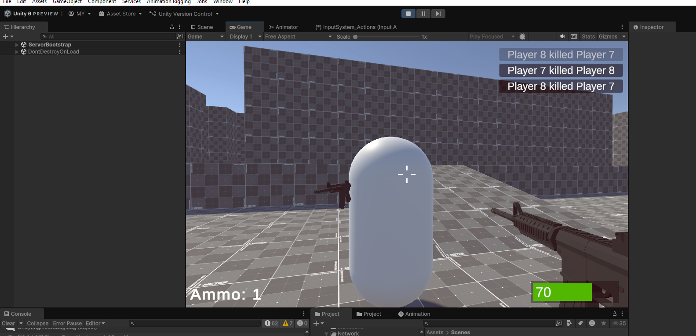

# Unity NGO Multiplayer FPS (COS 212: Game Software Development Project)

A Free-For-All (FFA) first-person shooter prototype built in Unity using Netcode for GameObjects (NGO).  
This project is intended as a learning and testing example for dedicated server and client builds.

---

## Overview

This project demonstrates:

- Dedicated server and client separation
- Scene synchronization using Unity NGO
- Basic FPS gameplay (movement, shooting, damage)
- A simple hardcoded server browser
- Server-authoritative gameplay logic

This is not a finished game, but a foundation for experimenting with multiplayer FPS architecture in Unity.

---

## Features

- Free-For-All multiplayer gameplay
- Dedicated server build support
- Server browser UI (hardcoded server list)
- Server-authoritative spawning and gameplay
- HUD and kill feed
- Basic FPS controls

---

## Project Structure

### Scenes

**ServerBootstrap**
- Contains all server-side prefabs and references
- Maps
- Player prefabs
- Networked objects required by the server
- Used alone when building a dedicated server

**GameScene**
- Client-side visuals and UI
- HUD, kill feed, weapons, and camera
- Used together with ServerBootstrap when building the client

> The client build includes both ServerBootstrap and GameScene so that scene synchronization works correctly with NGO.

---

## Server List System

The server list is currently hardcoded for testing purposes.

Each server entry includes:
- Server name / region
- Game mode
- Player count (placeholder)
- Ping (placeholder)
- IP address and port

This system is intended to simulate a real server browser and can later be replaced with a dynamic solution such as a backend service.

---

## Controls

- Move: WASD  
- Look: Mouse  
- Shoot: Left Mouse Button (Fire1)  
- Reload: R  
- Jump: Space  
- Toggle Cursor: Esc  

---

## How to Run

### Play in Editor

1. Open the project in Unity.
2. Open GameScene.
3. Press Play.

---

### Dedicated Server Build

1. Open Build Settings.
2. Add ServerBootstrap as the only scene.
3. Select Dedicated Server or Headless mode.
4. Build and run the server.

---

### Client Build

1. Open Build Settings.
2. Add scenes in this order:
   1. ServerBootstrap
   2. GameScene
3. Build for your target platform.
4. Launch the client and connect using the server list.

---

## Networking Notes

- Player input runs only on the owning client
- All authoritative actions occur on the server, including:
  - Player spawning
  - Damage calculation
  - Bullet and weapon spawning
- Clients request actions; the server validates and replicates results

---

## Assets Used

### Visual Assets
- Polygon Starter Pack
- Low Poly FPS Weapons Lite
- Prototype Map

### Audio Assets
- Low Poly Shooter Pack – Free Sample

All assets are used for prototyping and educational purposes only.

---

## Disclaimer

This project is a technical prototype and learning resource.  
Expect placeholder systems, hardcoded values, and incomplete features.

---

## Possible Future Improvements

- Dynamic server discovery
- Real ping measurement
- Player count synchronization
- Matchmaking
- Team-based modes
- Improved weapon and projectile syncing
- Backend integration
- Utilize Polygon Start Pack player models instead of basic capsules.
